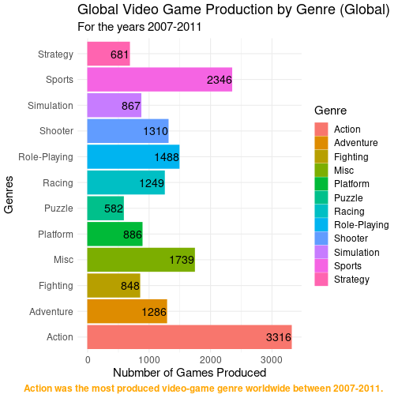

# Group3
Executive Summary

We used Kaggle.com to find our "Video Game Sales" data set. This set analyzes sales data from more than 16,500 games in countries from all over the world. This was published in 2017 by Gregory Smith. 
The fields are: 
Ranks, Name, Platform, Year, Genre, Publisher, NA Sales, EU Sales, JP Sales, Other sales and Global Sales. 

We looked at data from 2007-2011.  It includes data from games produced before 2007, but specifically focuses on sales numbers and production as of the years recorded.

Our research question was:
What is the most popular video game genre in the world? 

Our methodology was to use the different packages offered in Rstudio and create tibbles from the data set. We needed to count the genres, find the most produced genre in the given area and follow by counting the worldwide sales between the given years. These tibbles could then be used to create plots to show the different genres of games based on popularity.  As a general hypothesis, we focused on the number of games produced in general according to the data, assuming that there would be a correlation between produced quantity and popularity.

| Genre | Count |
|:---:|:---:|
| Action | 3316 |
| Sports | 2346 |
| Misc   | 1739 |
| Role-Playing | 1488 |
| Shooter | 1310 |
| Adventure | 1286 |
| Racing | 1249 |
| Platform | 886 |
| Simulation | 867 |
| Fighting | 848 |
| Strategy | 681 |
| Puzzle | 582 |

 
 
Our findings were that global sales most popular video game genre was action. European sales and North American sales mirrored that in having the most popular genre being action. 

